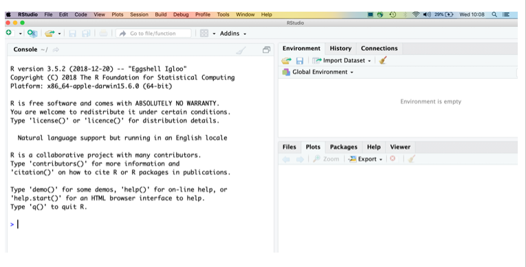
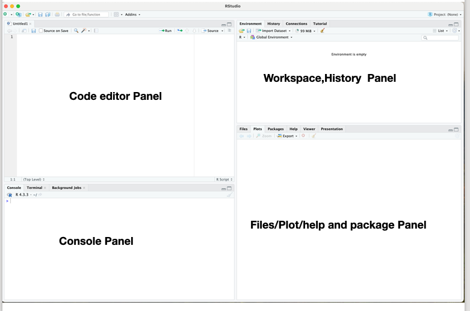
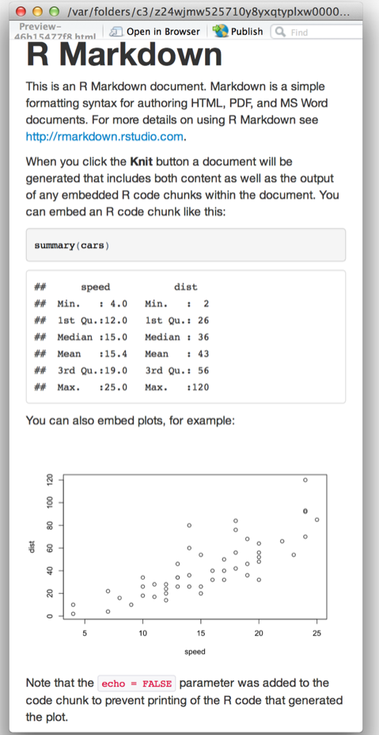
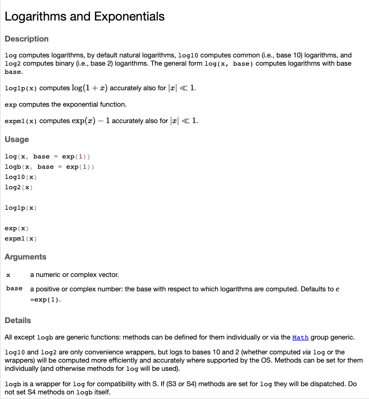
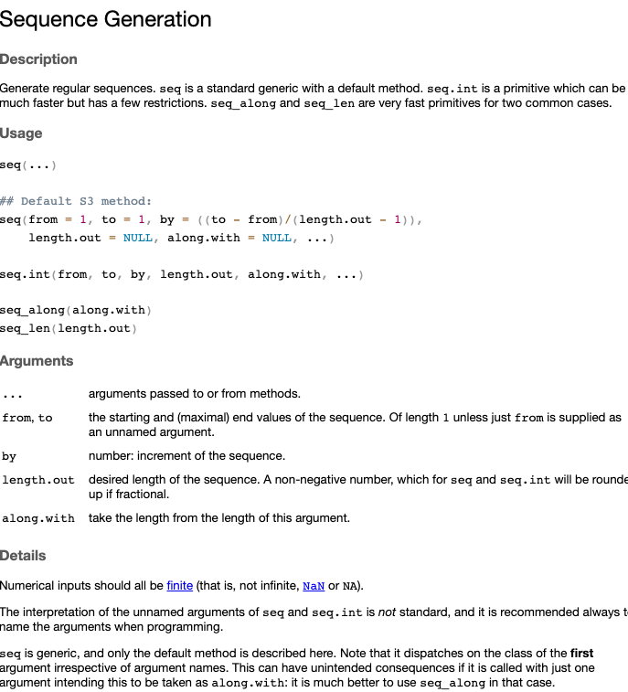
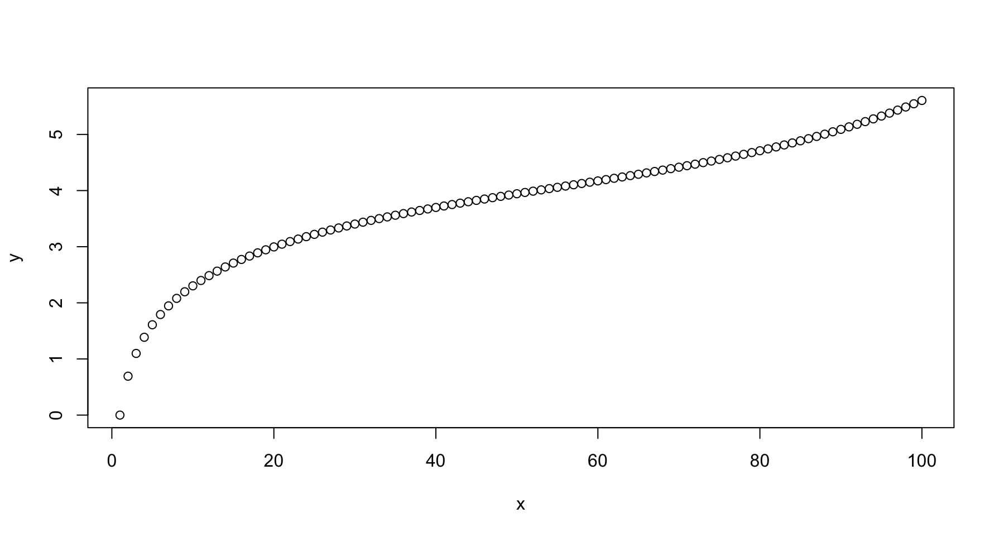
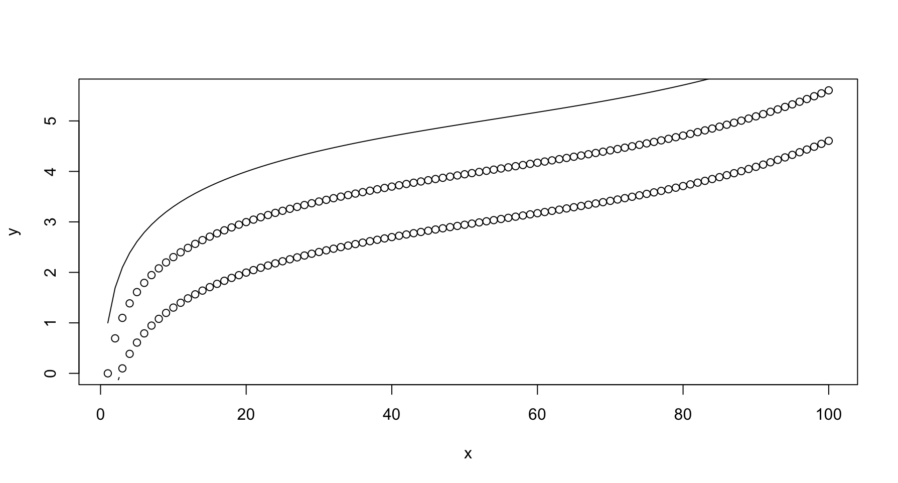
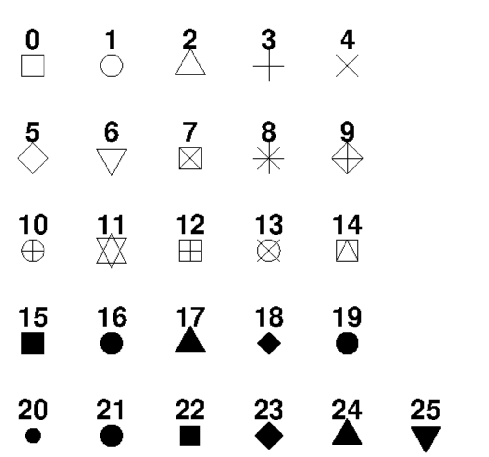
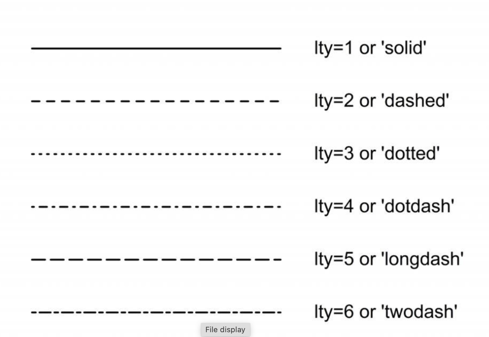

# R-Basics

R is a statistical programming language and is a powerful tool for data processing and manipulation. This module will be introduction to R and RStudio. You will learn about the different R visualization packages and how to create visual charts using the plot function.

## What is R ?

- R is a free open source software environment for statistical computing and graphics.
  
- It compiles and runs on a wide variety of UNIX platforms, Windows and MacOS.

- Command-line driven programming (no drop-down menus or buttons)


- R is an integrated suite of software facilities for data manipulation, calculation , graphical display and machine learning algorithm. It includes 
  - an effective data handling and storage facility,
  - a suite of operators for calculations on arrays, in particular matrices,
  - a large, coherent, integrated collection of intermediate tools for data analysis,
  - graphical facilities for data analysis and display either on-screen or on hardcopy with publication-quality plots, and
  - a well-developed, simple and effective programming language which includes conditionals, loops, user-defined recursive functions and input and output facilities.

[More information about R](https://www.r-project.org/)

[Download & install R](https://cloud.r-project.org)

## What is R Studio ?

- RStudio is an integrated development environment (IDE) for R. 

- It includes a console, syntax-highlighting editor that supports direct code execution, as well as tools for plotting, history, debugging and workspace management

- RStudio is available in open source and commercial editions and runs on the desktop (Windows, Mac, and Linux)




## Different Panels in R Studio

{ width=50% }

[More information about R Studio](https://posit.co)

[Download & install R Studio](https://posit.co/downloads/)


## Scripts and workspace

**R script (.R file)**

- Very useful instead of typing commands on the console.
- allows you to keep track of what you are doing and make any modification easier
- To actually execute some commands, you can select the lines and run the execution
  
 **Workspace (.Rdata file)** 
- The internal memory where R will store the objects you created during the session.
- To save only specific R objects: save(object_name(s),"name_of_file.RData")
- To save your entire workspace: save.image("name_of_file.RData")
- To load your workspace / specific R objects: load("name_of_file.RData")

## R Markdown

 R Markdown provides framework where single R Markdown file can generate
  - execute a Rscript
  - generate high quality reports that can be shared with an audience
  - fully reproducibel documentation with wide variety of dynamic output formats



[More about R Markdown ](https://rmarkdown.rstudio.com/lesson-2.html)


## Basic information on Syntax

- anything after a hash (#) is ignored – e.g. comments
- the variables are **case sensitive**:  variable name Data is not as same as data/DATA
- variable names can be alphanumeric include A-Z, a-z, 0-9, but can not start with a number
- variable names cannot have spaces in between. Spaces should be filled with "_" or "-" ie. my_data
- Always keep an informative vraiable name like "class_data" not "cd"
- Commands can be separated by ; or newline

## Basic Data Types in R

- **numeric** -  data are numbers that contain a decimal. Actually they can also be whole numbers  (10.5, 55, 787)

- **integer** -  whole numbers (those numbers without a decimal point).(1L, 55L, 100L, where the letter "L" declares this as an integer)

- **complex**  - (9 + 3i, where "i" is the imaginary part)

- **character** - data are used to represent string values  (a.k.a. string) - ("k", "R is exciting", "FALSE", "11.5")

- **logical**  (a.k.a. boolean) - (TRUE or FALSE)


## Operators

**Arithmetic Operators**

|Operator|Name|Example|
|:---:|:---:|:---:|
|+|Addition|x + y|
|-|Subtraction|x - y|
|*|Multiplication|x * y|
|/|Division|x / y|
|^|Exponent|x ^ y|
|%%|Modulus (Remainder from division)|x %% y|
|%/%|Integer Division|x%/%y|


**Comparison Operators**

|Operator|Name|Example|
|:---:|:---:|:---:|
|==|Equal|x == y|
|!=|Not equal|x != y|
|>|Greater than|x > y|
|<|Less than|x < y|
|>=|Greater than or equal to|x >= y|
|<=|Less than or equal to|x <= y|

**Logical Operators**


|Operator|Description|
|:---|:---|
|&|Element-wise Logical AND operator. It returns TRUE if both elements are TRUE|
|&&|Logical AND operator - Returns TRUE if both statements are TRUE|
|\||Elementwise- Logical OR operator. It returns TRUE if one of the statement is TRUE|
|\|\||Logical OR operator. It returns TRUE if one of the statement is TRUE.|
|!|Logical NOT - returns FALSE if statement is TRUE|


## First Run in R 

We’ll use the ‘Console’ panel first and do basic arithmetics

``
1+2
``
**[1] 3**


```
2^5+7
```
**[1] 39**


```
2^(5+7)
```
**[1] 4096**

```
log(20+pi)
```
**[1] 3.141632**


## Task 1: Find log2 of sum of three numbers 56,40 and 22

<details>

<summary>Task 1 answer </summary>

```

log2(22+40+56)

```
</details>

## More information or help

More information of a function can be accessed from R by using either one of the syntax. 

```
?log

```
 **or** 
 
```
help(log)
```

{ width=50% }


## Converting normal commands a  programming language

By assigning the data to to meaning full variaable we can reuse the variable multiple times 

```

Num_1<-1
Num_2<-2
Sum_12<-Num_1+Num_2 
Sum_12

```

**[1] 3**

## Task 2: 
1  Create 3 variable 'a1,a2,a3' for 3 numbers  56,40 and 22 

2. Create a sum of these 3 variables and store them in new variable A123 and
   
3. Log2 transform A123 and store in a new variable Log_A123. Display A123 and LA123
   

<details>

<summary>Task 2 answer </summary>

```
a1<-56
a2<-40
a3<-22

A123<-a1+a2+a3
A123

Log_A123<-log2(A123)
Log_A123
```
</details>


## Creating Vectors & some basic operations

List of items that are of the same types are called vectors 

In the example below, we create a vector variable called fruits, that combine strings:

**Vector of strings**
```
fruits <- c("banana", "apple", "orange")

# Print fruits
fruits

```

**Vector of numerical values**
```
numbers <-c(1.3, 0.32,10.5, 5.9, 6.3)

# Print numbers
numbers

```

**[1] 1.30 0.32 10.5 5.90 6.30**

## Operations in vector
Operations in vectors work element by element in an sequenctial format

```
multi_by<-5
numbers*multi_by

```
**[1]  6.5  1.6 52.5 29.5 31.5**

if a vector is short, R recycles it (reuses it) as needed

```
multi_by<-c(5,1)
numbers*multi_by
```

**[1]  6.50  0.32 52.50  5.90 31.50**

In the above example the vectors are multipled by sequential order and resued till the length of the largest vector

**(1.3*5) (0.32*1) (10.5*5)  (5.90*1) (6.30*5)**


## Generating sequencial numbers

Instead of hard coding the sequencial numbers such as 'c(1,2,3,4,5,6,7,8,9,10)'

```
1:10

```
will do the same output **[1]  1  2  3  4  5  6  7  8  9 10**

In order to create rever sequential number

```
10:1

```
**[1] 10  9  8  7  6  5  4  3  2  1**

## Using seq()

Another method to generate sequential number is to use **seq() function**  which is more flexible

```
seq(from=1, to=10)

```

## Task 3: 
Find what are the available parameters/options associated with function seq()
<details>
  <summary>Task 3 answer</summary>
  
```
help(seq)
```
{ width=50% }

</details>

## Task 4: 

- 1 create a vector of even numbers between 1 and 10

- 2 create a vector of odd numbers between 1 and 10 

<details>
  <summary>Task 4 answer</summary>
  
```
even_num<-seq(from=2, to=10,by=2)
even_num

odd_num<-seq(from=1, to=10,by=2)
odd_num

```

</details>

## Character strings as vector

```
charVector <- c("R","Basics","!")

charVector
```

What if we insert number(s) in between the vector containing Character strings


```
charVector <- c("R","Basics", 10:5,"!")

charVector
```
***[1] "R"      "Basics" "10"     "9"      "8"      "7"      "6"      "5"      "!"***

even integers are converted as strings

## Subsetting vectors

**Subset by index**

```
numbers
numbers[2]
```

**Subset by range**

```
numbers[2:5]
```

**Subset by range**

```
numbers[2:5]
```
**Subset by condition**

```
numbers[numbers>5]

```
***[1] 10.5  5.9  6.3***

**Check if data is present**

```
"apple" %in% fruits

```
**Finding length**

```
length(numbers)
length(fruits)

```
**Adding new element**

```
fruits<-append(fruits, "jackfruit", after = 2)
numbers<-append(numbers, 10)


```
**Remove an element**

```
newfruits <- fruits[-1]
newfruits
fruits
```
**Replacing by index**

```
newfruits
newfruits[1] <- "dragonfruit"
newfruits
```

**Sorting**

```
sort(fruits) 
sort(numbers)

```

**Repeat the Vectors**

```
repeat_each <- rep(c("Control","Treatment","AfterTreatment"), each = 3)
```

## Task 5: 

- Subset the 2nd last index of a vector

  <details>
  <summary>Task 5 answer</summary>
    ```
    numbers[-2]

    ```
  </details>

## Traversing through Different location

Find the current location

```
getwd()
```

changing location 

```
  setwd("~/Desktop") #like cd command in linux

```

Listing the Files in a Directory/Folder

```
  dir() #current location
  dir("~/Documents") #Specify another location
```


## Importing local data 

By defualt R can imort few variaties of flat files using the following commands such as

- read.table()
- read.csv()
- read.delim()


R can also Read other pleanty of formats by installing specific libraries such as :

- Read Excel spreadsheets (readxl)

- Directly access databases (RODBC)

R can access filesover the web

```
MyData<-read.csv("https://www.proteinatlas.org/ENSG00000134057.tsv",sep="\t",header=T)
View(MyData)

```
## Data frames

Data frames is a structured format made of columns(measurment) and rows (units)

each Columns can hold different variables types

**access first column**

```
MyData[,1] 
```

**access column "Ensembl"**

```
MyData[, "Ensembl"]
MyData$Ensembl
MyData[["Ensembl"]]
MyData[3] #by index
```
**Creating data frames from scratch**

```
SI <- 1:10
Marks <- seq(from=5,to=10,length=10)
Names <- c("Name1","Name2","Name3","Name4","Name5", "Name6","Name7","Name8","Name9","Name10")
df <- data.frame(RollNumber=SI, Grade=Marks, Subject=Names)
df
```

**Column names of dataframe**

```
names(df)
```
***[1] "RollNumber" "Grade"      "Subject"***


**FindingDiminesion (number of rows and columns)  dataframe**

```
dim(df) #dimension
nrow(df) # number of rows
ncol(df) #number of columns
length(df) # length(number of columns)

```
**Adding new columns to existing dataframe**

```
df$AverageGrade <- 50:41

```
**Summarising the dataframe**

```
summary(df)

```

**Remove the first row and column**

```
dfNew <- df[-c(1), -c(1)]
```

**Combining Data Frames**

```
df2<-df #Making copy
Combined <- rbind(df, df2) ## Concating the Dataframe
View(Combined)

```

## Subseting data from dataframe

Subset the data frame based on a column value

```

Combined[Combined$Subject == "Name1", ]


```

Subset the data frame based on a column value & display the values from specific column


```

Combined[ Combined$Subject == "Name1", "AverageGrade" ]


```

Subset the data frame based on multiple columns


```

Combined[ (Combined$RollNumber> 3 & Combined$Grade>5),]


```


## Task 6: 

- create a dataframe variable 'mcu_films' by reading data through internet from this [location](https://www.openintro.org/data/tab-delimited/mcu_films.txt)
- Find the number of columns and rows in the mcu_films dataframe
- Create a new dataframe 'mcu_world_gross' with highest world wide gross in descending order
- create a new table based on movie title haveing text 'Avengers'
- write the output into a text file called 'Avengers.txt' in desktop

<details>
  <summary>Task 6 answer</summary>
    
  ```
      # Reading file 
    mcu_films<-read.csv("https://www.openintro.org/data/tab-delimited/mcu_films.txt",sep="\t",header=T)
    View(mcu_films)
    
    # Find the column names of the datframe
    names(mcu_films)
    
    #Find the dimension of the dataframe
    dim(mcu_films)
    
    #Sort the table with highest gross collection (descending order) in the world and store in to a new dataframe called 'mcu_world_gross'
    mcu_world_gross <- mcu_films[order(-mcu_films$gross_world),]
    View(mcu_world_gross)
    
    
    #create a new table based on movie title haveing text 'Avengers'
    Avengers <- subset(mcu_films, grepl("Avengers", movie))
    View(Avengers)
    
    #output
    write.table(Avengers,file="Avengers.txt")
  
```

</details>


# R Graphics

R can generate high resolution customised graphs and figures. This can be achieved using default libraries or using external libraries
- base (plot function)
- ggplot2
- lattice (3D plots)

## plot function

plot function needs 2 parameters X-axis and Y-axis

```
x <- 1:100
y <- log(x) + (x/100)^5
plot(x,y)
```


Customization of the plots
- points() to add points to an existing plot
- lines() to add a line to an existing plot
- col indicating the colour
- lwd indicating the line width
- lty indicating the line type
- pch indicating the plotting character (symbol)
```
lines(x,y+1)
points(x,y-1, type="b")
```








